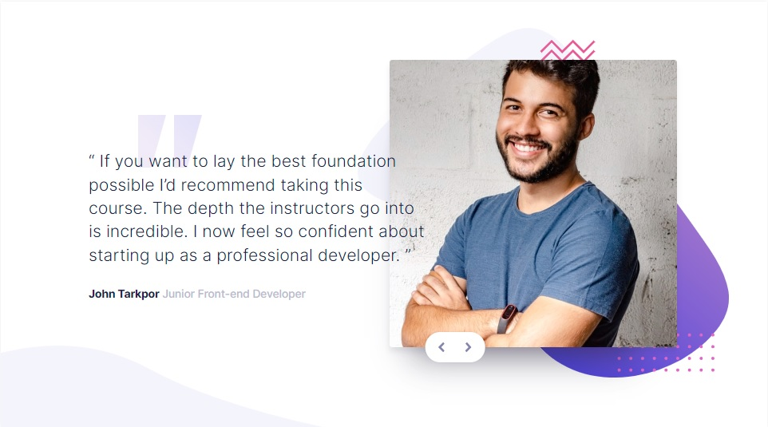

# Frontend Mentor - Coding bootcamp testimonials slider solution

This is a solution to the [Coding bootcamp testimonials slider challenge on Frontend Mentor](https://www.frontendmentor.io/challenges/coding-bootcamp-testimonials-slider-4FNyLA8JL). Frontend Mentor challenges help you improve your coding skills by building realistic projects. 

## Table of contents

- [Overview](#overview)
  - [The challenge](#the-challenge)
  - [Screenshot](#screenshot)
  - [Links](#links)
- [My process](#my-process)
  - [Built with](#built-with)
  - [What I learned](#what-i-learned)
  - [Continued development](#continued-development)
  - [Useful resources](#useful-resources)
- [Author](#author)
- [Acknowledgments](#acknowledgments)

## Overview

### The challenge

Users should be able to:

- View the optimal layout for the component depending on their device's screen size
- Navigate the slider using either their mouse/trackpad or keyboard

### Screenshot

| Desktop layout |
|:--:|
 

| Mobile layout |
|:--:|
  !

### Links

- Solution URL: https://github.com/PavlinaPs/coding-bootcamp-testimonials-slider
- Live Site URL: https://pavlinaps.github.io/coding-bootcamp-testimonials-slider

## My process

### Built with

- Semantic HTML5 markup
- CSS custom properties
- Flexbox
- CSS Grid
- Mobile-first workflow

### What I learned

- ##### @font-face
For the first time I downloaded the font and added it in css @font-face rule:

```css
@font-face {
    font-family: 'Inter';
    src: url(../../src/font/Inter-Medium.ttf) format("truetype");
    font-weight: 500;
}
```
[Multiple font-weights, one @font-face query](https://stackoverflow.com/questions/28279989/multiple-font-weights-one-font-face-query) on Stack Overflow
[How to use @font-face in CSS](https://css-tricks.com/snippets/css/using-font-face-in-css/) on CSS Tricks

- ##### Center absolutely positioned element
```css
.card__slider {
    position: absolute;
    bottom: 3.7rem;
    left: 50%;
    transform: translateX(-50%);
    ...
}
```
[Horizontal centering of an absolute element](https://css-tricks.com/forums/topic/horizontal-centering-of-an-absolute-element/) on CSS Tricks

- ##### Slider keyboard focus
I added tabindex include the slider in tab order.
```html
<div id="prev" class="card__arrow" tabindex="0">
  
</div>
```
The slides switch also on enter.
```js
next.addEventListener('keydown', (e) => {
    if(e.key === "Enter"){
        toggleSlide();
    }
});
```
And finally I changed the default outline style of an element in keyboard focus. The outline is not visible on click:

```css
.card-arrow:focus-visible {
    outline: none;
    border: 0.3rem dotted var(--clr-grayish-blue);
    border-radius: 2rem;
}
```
Keyboard focus mobile

Keyboard focus desktop


[:focus-visible](https://developer.mozilla.org/en-US/docs/Web/CSS/:focus-visible) on MDN

### Continued development

I should try to code it with more the two slides, maybe also with a dot indicator.

### Useful resources

[Multiple font-weights, one @font-face query](https://stackoverflow.com/questions/28279989/multiple-font-weights-one-font-face-query) on Stack Overflow
[How to use @font-face in CSS](https://css-tricks.com/snippets/css/using-font-face-in-css/) on CSS Tricks
[Horizontal centering of an absolute element](https://css-tricks.com/forums/topic/horizontal-centering-of-an-absolute-element/) on CSS Tricks
[:focus-visible](https://developer.mozilla.org/en-US/docs/Web/CSS/:focus-visible) on MDN


## Author

- GitHub - [PavlinaPs](https://github.com/PavlinaPs)
- Frontend Mentor - [@PavlinaPs](https://www.frontendmentor.io/profile/PavlinaPs)

## Acknowledgments

It is great that I can solve Frontend Mentor's challenges. They are all very useful for me. Every single one. Thank you!
